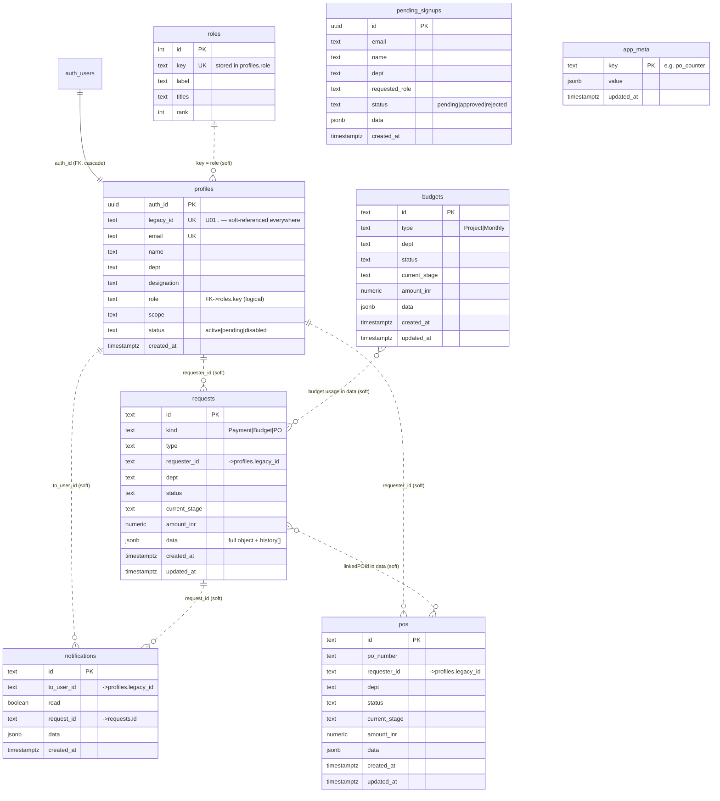

# Backend Architecture — Elecbits Finance Tool

> Status: as-built (reflects `supabase/migrations/0001`–`0004`, `src/lib/*`, and
> `scripts/seed.ts`). Last reviewed 2026-06-05.

## 1. Overview

Elecbits Finance Tool is an **internal finance-operations app** (payment
requests, budgets, purchase orders, approvals) for a ~21-person org. There is no
custom application server: the "backend" is **Supabase** (managed Postgres +
GoTrue auth + PostgREST), accessed directly from the React/Vite browser client
through the `@supabase/supabase-js` SDK.

```
┌──────────────────────────────────────────────────────────┐
│  Browser (React + Vite, hosted on Vercel)                │
│                                                          │
│   src/App.tsx ── React state holds full entity arrays    │
│        │                                                 │
│        ├── src/lib/auth.ts     (sign in/up, profiles)    │
│        ├── src/lib/db.ts       (fetch* / save* arrays)   │
│        ├── src/lib/access.ts   (who-can-see / who-can-act)│
│        ├── src/lib/workflow.ts (approval routing)        │
│        ├── src/lib/finance.ts  (budget/PO math)          │
│        └── src/lib/supabase.ts (anon-key client)         │
└─────────────────────────┬────────────────────────────────┘
                          │  HTTPS (PostgREST + GoTrue), anon JWT
                          ▼
┌──────────────────────────────────────────────────────────┐
│  Supabase project                                        │
│   • auth.users          (GoTrue identities)              │
│   • public.* tables     (profiles, requests, budgets, …) │
│   • Row Level Security  (blocks anon; gates profiles)    │
│   • is_admin() SECURITY DEFINER function                 │
└──────────────────────────────────────────────────────────┘
```

**Design philosophy.** One table per entity. Each row keeps a few **promoted,
indexed scalar columns** (status, dept, amount…) for querying/reporting, plus a
`data jsonb` column holding the **full application object** exactly as the React
code builds it (line items, history arrays, etc.). This is genuinely relational
(real tables, PKs, FKs, RLS) without forcing a rewrite of the form/page code.

**Trust model.** This is an internal tool. Any *authenticated* employee can read
and write the shared finance tables; fine-grained role/department gating is
enforced **in the app** (`src/lib/access.ts`), not the database. RLS's job here
is to block anonymous access and to protect `profiles` (self vs. admin updates).
If you later want the DB to enforce per-role permissions, tighten the policies.

## 2. Technology stack

| Layer | Choice |
|---|---|
| Database | Postgres (Supabase-managed) |
| Auth | Supabase Auth / GoTrue (email + password) |
| API | PostgREST, auto-generated from the schema, via `supabase-js` |
| Client SDK | `@supabase/supabase-js` ^2.106 |
| Frontend | React 18 + Vite 5 + TypeScript + Tailwind |
| Hosting | Vercel (frontend); Supabase cloud (backend) |
| Seeding | `scripts/seed.ts` run with `tsx` + service-role key |

## 3. Database schema

All tables live in the `public` schema. Migrations are applied in the Supabase
SQL Editor (or `supabase db push`) in order. A consolidated, ready-to-run
version of the full schema lives in
[`supabase/schema.sql`](../supabase/schema.sql).

### 3.0 Entity-relationship diagram

`auth.users → profiles` is the only **enforced** foreign key (`on delete
cascade`). Every other link is a **logical reference by `legacy_id` (U01..)** or
by id string stored inside `data jsonb` — PostgREST/RLS don't enforce them, the
app does. Dashed lines below denote these soft references.



### 3.x Table reference

### 3.1 `profiles` — org identity (1:1 with `auth.users`)

| Column | Type | Notes |
|---|---|---|
| `auth_id` | uuid PK | FK → `auth.users(id)` `on delete cascade` |
| `legacy_id` | text unique | `U01..` id preserved so existing seed data / PO references (`requesterId`, `selectedApprovers`, `approvedBy`, `scope`) keep working |
| `email` | text unique not null | |
| `name` | text not null | |
| `dept` | text | |
| `designation` | text | |
| `role` | text not null default `'Employee'` | system role consumed by `access.ts` |
| `scope` | text | e.g. `ODM-SALES` |
| `status` | text not null default `'active'` | `active` \| `pending` \| `disabled` |
| `created_at` | timestamptz default now() | |

### 3.2 `requests` — unified workflow items

`kind` = `Payment` \| `Budget` \| `PO` request.

| Column | Type | Notes |
|---|---|---|
| `id` | text PK | app-generated id |
| `kind`, `type` | text | discriminators |
| `requester_id` | text | legacy `U01..` id |
| `dept`, `status`, `current_stage` | text | promoted for queries |
| `amount_inr` | numeric | from `amountINR`/`amount` |
| `data` | jsonb not null | full object (line items, `history[]`, …) |
| `created_at`, `updated_at` | timestamptz default now() | |

Indexes: `status`, `requester_id`, `dept`.

### 3.3 `budgets` — approved allocations (project + monthly)

`id` (PK), `type`, `dept`, `status`, `current_stage`, `amount_inr`, `data jsonb`,
timestamps. Indexes: `dept`, `type`.

### 3.4 `pos` — purchase orders

`id` (PK), `po_number`, `requester_id`, `dept`, `status`, `current_stage`,
`amount_inr`, `data jsonb`, timestamps. Indexes: `status`, `dept`.

### 3.5 `notifications` — per-user inbox

`id` (PK), `to_user_id`, `read boolean default false`, `request_id`, `data jsonb`,
`created_at`. Index: `to_user_id`.

### 3.6 `pending_signups` — self-service signups awaiting approval

`id` (uuid PK, `gen_random_uuid()`), `email`, `name`, `dept`, `requested_role`,
`status` (`pending` \| `approved` \| `rejected`), `data jsonb`, `created_at`.

### 3.7 `app_meta` — key/value singletons

`key` (text PK), `value jsonb not null`, `updated_at`. Currently holds
`po_counter` (next PO sequence number).

### 3.8 `roles` — reference catalog (migration 0004)

The 7 flat role-groups an admin assigns to employees. `key` is the value stored
in `profiles.role`; the catalog gives the admin UI a single source of truth +
labels.

| id | key | label | rank |
|---|---|---|---|
| 1 | `Employee` | Employee | 1 |
| 2 | `DeptApprover` | Department Head | 2 |
| 3 | `Accountant` | Accountant | 3 |
| 4 | `FinanceHead` | Finance Head | 4 |
| 5 | `VP` | Vice President | 5 |
| 6 | `CEO` | CEO | 6 |
| 7 | `SuperManager` | Special Access | 7 |

## 4. Security model (Row Level Security)

RLS is **enabled on every table**, so the anon role cannot touch anything.

| Table(s) | Policy | Effect |
|---|---|---|
| `requests`, `budgets`, `pos`, `notifications`, `app_meta` | `<t>_auth_all` (FOR ALL) | any **authenticated** user may read/write (`using true / with check true`) |
| `profiles` | `profiles_read` | any authenticated user reads all profiles (needed for approver-routing directory) |
| `profiles` | `profiles_update_self` | a user may UPDATE only their own row (`auth.uid() = auth_id`) |
| `profiles` | `profiles_insert_self` (0002) | a freshly signed-up user may INSERT only their own row |
| `profiles` | `profiles_update_admin` (0003) | admins may UPDATE **any** profile |
| `pending_signups` | `pending_insert` / `pending_read` / `pending_update` | authenticated users may insert/read/update |
| `roles` | `roles_read` | authenticated read-only reference |

### 4.1 `is_admin()` — admin check without RLS recursion

Admin update of arbitrary profiles needs to read the caller's own role from
`profiles`, but reading `profiles` inside a policy on `profiles` causes infinite
RLS recursion. The fix is a `SECURITY DEFINER` function that bypasses RLS for the
role lookup:

```sql
create or replace function public.is_admin()
returns boolean language sql security definer stable
set search_path = public as $$
  select exists (
    select 1 from public.profiles
    where auth_id = auth.uid()
      and role in ('SuperManager', 'CEO', 'Admin')   -- 'Admin' added in 0004
  );
$$;
```

`profiles_update_admin` is `using (public.is_admin()) with check (public.is_admin())`.

### 4.2 Application-level access control (`src/lib/access.ts`)

Because the DB grants broad read/write to authenticated users, the *real*
visibility and action rules live in the client:

- `canUserSeeRequest(user, request)` / `filterByAccess` — own requests always
  visible; finance/exec roles see all; specific dept heads (by legacy id) see
  their dept (e.g. `U08` → ODM, `U09` → HR, Box Build trio → Box Build).
- `canUserActOnRequest(user, request)` — terminal statuses lock the row;
  per-stage gating (`DeptApproval`, `VP`, `CEO`, `FinanceHead`, `Accountant`,
  `SuperManagerApproval`), SuperManager override, and one-approval-per-user.

> ⚠️ These are **client-side** checks. A motivated authenticated user could
> bypass them via the SDK. Acceptable under the internal-tool trust model; move
> to RLS/RPC if the threat model changes.

## 5. Authentication & account lifecycle (`src/lib/auth.ts`)

The browser client (`src/lib/supabase.ts`) is created with the **anon** key,
`persistSession: true`, `autoRefreshToken: true`.

- **Sign in** — `signIn(email, password)`. The dedicated admin types the bare
  username `admin`, mapped to `ADMIN_EMAIL` (`admin@elecbits.in`) by
  `resolveLoginEmail`. After auth, the matching `profiles` row is loaded;
  `pending` → "awaiting approval", `disabled` → "account disabled".
- **Session restore** — `getCurrentUser()` reads the Supabase session and maps
  the profile to the app's `currentUser` shape via `toUser` (keeps `legacy_id`
  as `id`).
- **Self-service signup** — `signUp(...)` creates the GoTrue user, then upserts a
  `profiles` row with `status='pending'` and inserts a `pending_signups` record.
- **Admin review** — `listPendingSignups`, `approveSignup` (sets role/dept/
  designation, `status='active'`), `rejectSignup` (`status='disabled'`).
- **Admin console** — `listRoles`, `listEmployees`, `setEmployeeRole`,
  `setEmployeeStatus` (active/disabled). Enforced server-side by
  `profiles_update_admin` + `is_admin()`.

> ⚠️ **Email confirmation must be OFF** in Supabase (Auth → Providers → Email →
> "Confirm email"). Otherwise `signUp()` returns no session, the
> `profiles_insert_self` insert runs as anon, and RLS rejects it — the profile
> is never written. (See migration 0002 header.)

## 6. Data-access layer (`src/lib/db.ts`)

Mirrors the legacy `window.storage` model: the app holds **full arrays in React
state** and calls `save*(fullArray)` on every mutation.

- **Read** — `fetchRequests/Budgets/POs/Notifications` → `select('*')`, then
  `unwrap` returns each row's `data` object.
- **Write** — `replaceAll(table, items)`: an **upsert-all + prune** strategy.
  1. Map each app object to a row via a per-table `EXTRACTOR` (promoted columns +
     `data`).
  2. `upsert(rows, { onConflict: 'id' })`.
  3. **Prune**: `delete` every row whose `id` is no longer in the array
     (`.not('id','in', (...))`), so client-side deletions propagate.
- **PO counter** — `fetchPOCounter` / `savePOCounter` against `app_meta`.

`src/App.tsx` wires this up: on load it fetches all collections (auto-seeding
budgets/POs/`po_counter` if the tables are empty), and each `save*` setter writes
React state through to `db.*`.

> ⚠️ **Concurrency caveat.** "Replace the whole array" is last-write-wins across
> the entire collection. Two users editing different requests concurrently can
> clobber each other, and the prune step deletes rows a client didn't know about.
> Fine for a small org with light concurrency; revisit (row-level upserts /
> realtime) if usage grows.

## 7. Approval workflow (`src/lib/workflow.ts`)

Routing is computed client-side and persisted in each request's
`current_stage` + `data.history[]`.

- `getEligibleDeptApprovers(requester, type, isProject)` — picks dept approvers
  by dept/scope/role (ODM, Sales, Box Build, HR, Product+Marketing, Finance,
  Executive, Management).
- `needsBoxBuildMidApproval(requester)` — Box Build PM/Vendor Manager extra step.
- `computeNextStage(request, currentStage, approver)` — the state machine.
  Thresholds: `VP_THRESHOLD = ₹100,000`, `CEO_THRESHOLD = ₹500,000`. PO ≥ CEO
  threshold routes VP → SuperManagerApproval; SuperManager can override
  intermediate stages (except a PO's own SuperManagerApproval stage).
- `getStageLabel(stage, kind)` — human labels per `kind` (Payment/Budget/PO).

Typical happy paths:
- **Payment**: `DeptApproval → [VP|CEO|FinanceHead] → Accountant → Paid`
- **Budget**: `… → FinanceHead → Active`
- **PO**: `… → FinanceHead → Accountant (assign PO number) → Approved`

Finance math (`src/lib/finance.ts`): line-item GST totals, active project/monthly
budget lookup + usage, PO usage/availability, `formatPONumber` →
`Az-PO-2526-0001`.

## 8. Configuration & secrets

`.env.local` (gitignored; see `.env.example`):

| Var | Scope | Purpose |
|---|---|---|
| `VITE_SUPABASE_URL` | browser | Supabase API URL (`*.supabase.co`) |
| `VITE_SUPABASE_ANON_KEY` | browser | anon public key (RLS-gated) |
| `SUPABASE_SERVICE_ROLE_KEY` | server/seed only | **bypasses RLS** — never ship to browser or commit |
| `ADMIN_PASSWORD` | seed only | admin account password (default `admin@123`) |

On Vercel, set the two `VITE_*` vars in Project Settings → Environment Variables
(Production) and redeploy. `src/lib/supabase.ts` renders a readable config-error
page if they're missing instead of a blank crash.

## 9. Seeding (`scripts/seed.ts`, `npm run seed`)

Idempotent, run with the service-role key (bypasses RLS, can create auth users):

1. `seedRoles` — upsert the 7 role-groups (belt-and-suspenders vs. 0004).
2. `seedAdmin` — create/sync `admin@elecbits.in` (role `Admin`); rotating
   `ADMIN_PASSWORD` + re-running updates the password.
3. `seedUsers` — create the 21 employee auth accounts + `profiles` rows
   (`email_confirm: true`).
4. `seedBudgets` / `seedPOs` — load demo data from constants.
5. `seedCounter` — set `po_counter = 2`.

Re-running is safe (upserts on conflict; existing auth users are looked up).

## 10. Operational notes & known limitations

- **Client-side authorization** — see §4.2 / §5. Not DB-enforced.
- **Whole-array writes** — last-write-wins; prune can delete unseen rows (§6).
- **Email confirmation OFF** — required for self-service signup (§5).
- **Service-role key** — used only by the local seed script; must never reach
  the browser or git.
- **No server-side validation** — amounts, GST, thresholds are validated in the
  client; the DB accepts whatever an authenticated user upserts.
- **Migrations are forward-only** SQL files; apply in numeric order.

## 11. File map

| File | Responsibility |
|---|---|
| `supabase/migrations/0001_init.sql` | tables + RLS |
| `supabase/migrations/0002_profiles_self_insert.sql` | signup self-insert policy |
| `supabase/migrations/0003_profiles_admin_update.sql` | `is_admin()` + admin update policy |
| `supabase/migrations/0004_roles_and_admin.sql` | `roles` catalog; `Admin` role in `is_admin()` |
| `src/lib/supabase.ts` | browser anon client |
| `src/lib/auth.ts` | auth + account lifecycle + admin console API |
| `src/lib/db.ts` | data-access (fetch/save arrays, prune, PO counter) |
| `src/lib/access.ts` | client-side visibility & action gating |
| `src/lib/workflow.ts` | approval routing state machine |
| `src/lib/finance.ts` | budget / PO / GST math |
| `scripts/seed.ts` | idempotent seed (users, admin, roles, demo data) |
| `SUPABASE_SETUP.md` | one-time setup runbook |
